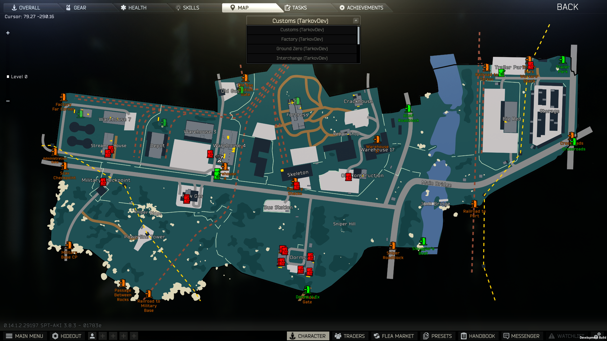
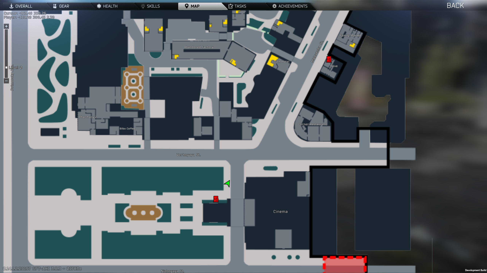
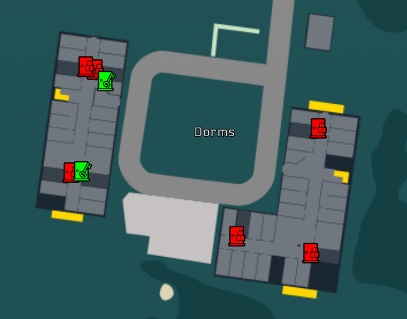
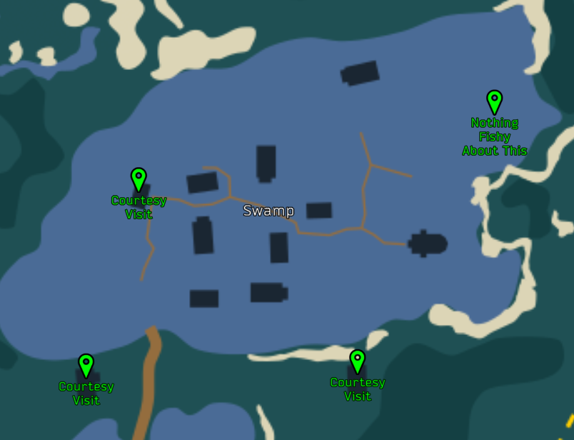
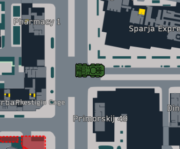
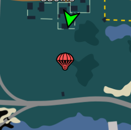

## About Mod

An SPT mod that adds a custom in-game map viewer in the place of the BSG map screen. Includes pre-configured maps made by [TarkovData](https://github.com/TarkovTracker/tarkovdata/) and [TarkovDev](https://github.com/the-hideout/tarkov-dev).

#### Full screen out of raid maps with selector

#### Full screen in-raid with player marker

#### Dynamic Locks

#### Quest Indicators

#### BTR Marker

#### Airdrop Marker

#### Corpse Markers

### Features

- Map organized in stacked layers / levels
  - Text map labels supported overlaid on map
  - Automatic selection of layer based on player position (configurable)
  - Manual level control available on left of map screen (as well as shift-scroll and configurable hotkeys)
- Automatic min/max zoom based on size of map
- Support for coordinate rotation, since BSG decided to make north different direction on many of the maps
- Drag-based map pan and mousewheel-based map zoom controls; additional hotkeys for map control available (configurable)
- Peek at map hotkey (configurable)
- Icon-based map markers placed both statically and dynamically. Currently:
  - In-raid dynamic player icon
  - In-raid dynamic current extracts for player
  - In-raid dynamic quest icons (loosely based on [Prop's GTFO](https://github.com/dvize/GTFO))
  - In-raid dynamic player-dropped backpacks
  - In-raid dynamic BTR icon (with icon by Kuromi, see [`marker_credits.txt`](Resources/Markers/marker_credits.txt) for more info)
  - In-raid dynamic airdrop icons (generated when airdrop lands)
  - In-raid dynamic markers for corpses
  - In-raid dynamic other players/bots icons
    - Friendly players will only show if using another mod that adds multiplayer or adds friendly bots (not sure if that exists)
    - Enemy players, bosses, and scavs off by default, intended for mostly debug
  - Static markers for all extracts for all maps out-of-raid
  - Statically-loaded locked door with dynamic icon and color based on key status
    - Out-of-raid, green with key means player has it in inventory, yellow with key means key in stash, red with lock otherwise
    - In-raid, green with key means player has the key, red with lock means player doesn't have key
  - Static markers for switches and levers

See [`KNOWN_ISSUES.md`](KNOWN_ISSUES.md) for known current issues and [`FEATURE_WISHLIST.md`](FEATURE_WISHLIST.md) for a list of things that I would like to work on in the future.

## Configuration

### General

- **Replace Map Screen**: If the map should replace the BSG default map screen, requires swapping away from modded map to refresh
- **Center on Player Hotkey**: Pressed while the map is open, centers the player
- **Move Map * Hotkey**: Hotkey to move the map *
- **Move Map Hotkey Speed**: How fast the map should move, units are map percent per second
- **Change Map Level * Hotkey**: Hotkey to move the map level * (shift-scroll also does this in map screen)
- **Zoom Map * Hotkey**: Hotkey to zoom the map * (scroll also does this in map screen)
- **Zoom Map Hotkey Speed**: Zoom Map Hotkey Speed
- **Dump Info Hotkey**: Pressed while the map is open, dumps json MarkerDefs for extracts, loot, and switches into root of plugin folder (only shows in advanced config mode)

### Dynamic Markers

- **Show Player Marker**: If the player marker should be shown in raid
- **Show Friendly Player Markers**: If friendly player markers should be shown
- **Show Enemy Player Markers**: If enemy player markers should be shown (generally for debug)
- **Show Scav Markers**: If enemy scav markers should be shown (generally for debug)
- **Show Boss Markers**: If enemy boss markers should be shown
- **Show Locked Door Status**: If locked door markers should be updated with status based on key acquisition
- **Show Quests In Raid**: If quests should be shown in raid
- **Show Extracts In Raid**: If extracts should be shown in raid
- **Show Extracts Status In Raid**: If extracts should be colored according to their status in raid
- **Show Dropped Backpack In Raid**: If the player's dropped backpacks (not anyone elses) should be shown in raid
- **Show BTR In Raid**: If the BTR should be shown in raid
- **Show Airdrop In Raid**: If airdrops should be shown in raid when they land
- **Show Friendly Corpses In Raid**: If friendly corpses should be shown in raid
- **Show Player-killed Corpses In Raid**: If corpses killed by the player should be shown in raid, killed bosses will be shown in another color
- **Show Friendly-killed Corpses In Raid**: If corpses killed by friendly players should be shown in raid, killed bosses will be shown in another color
- **Show Boss Corpses In Raid**: If boss corpses (other than ones killed by the player) should be shown in raid
- **Show Other Corpses In Raid**: If corpses (other than friendly ones or ones killed by the player) should be shown in raid

### In-Raid

- **Auto Select Level**: If the level should be automatically selected based on the players position in raid
- **Auto Center On Player Marker**: If the player marker should be centered when showing the map in raid
- **Reset Zoom On Center**: If the zoom level should be reset each time that the map is opened while in raid
- **Centering On Player Zoom Level**: What zoom level should be used as while centering on the player (0 is fully zoomed out, and 1 is fully zoomed in)
- **Peek at Map Shortcut**: The keyboard shortcut to peek at the map
- **Hold for Peek**: If the shortcut should be held to keep it open. If disabled, button toggles

## Installation

[Releases are here](https://github.com/mpstark/SPT-DynamicMaps/releases). Open zip file and drag `BepInEx` folder into root of your SPT-AKI install.

## License

Distributed under the MIT license. See [`LICENSE.txt`](LICENSE.txt) for more details.

## Acknowledgments

- [CJ](https://github.com/CJ-SPT) for letting me hack on [StashSearch](https://github.com/CJ-SPT/StashSearch) as my first SPT-AKI modding experience
- [DrakiaXYZ](https://github.com/DrakiaXYZ) for having multiple great mods to look at for examples
- [Arys](https://github.com/Nympfonic) for being awesome
- [Kuromi](https://github.com/schkuromi/) for the BTR icon and constant support
- Multiple people in the SPT Discord for suggestions and encouragement
